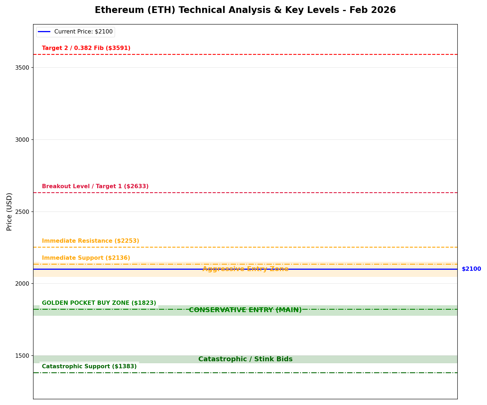

# Глубокий Технический Анализ Ethereum (ETH) - Февраль 2026

## 📉 Рыночный Контекст: Консолидация и Медвежье Давление

Ethereum в данный момент находится в фазе консолидации, колеблясь вокруг уровня **$2,100**. Общий тренд сохраняется от медвежьего к нейтральному, активу сложно закрепиться выше ключевых структурных уровней.

## 🔗 On-Chain и Фундаментальный Анализ (Новое)

### 1. Активность Китов (Whales)
*   **Смешанные сигналы:** В феврале наблюдается интересная борьба. С одной стороны, крупные кошельки (10k-100k ETH) **накапливают** позиции, выкупая продажи более мелких игроков.
*   **Вывод с бирж:** Зафиксированы крупные выводы (например, 80,000 ETH с Binance), что обычно является бычьим знаком (киты уводят монеты в холодное хранение).
*   **Риски:** Один из древних китов (эры ICO) проснулся и завел 50,000 ETH на Gemini. Это создает потенциальный риск навеса продаж.

### 2. Потоки Бирж (Exchange Flows)
*   **Рекордно низкие резервы:** Общее количество ETH на биржах находится на минимумах с 2016 года (~16.3 млн ETH). Дефицит ликвидности (Supply Shock) может привести к резкому росту цены при появлении спроса.
*   **ETF Оттоки:** В начале февраля наблюдался отток из спотовых ETF (BlackRock, Fidelity), что оказало давление на цену.
*   **Всплеск инфлоу:** При падении ниже $2,000 был замечен кратковременный всплеск ввода монет на биржи для продажи в панике.

### 3. Вывод по On-Chain
Рынок находится в фазе "перетягивания каната". **Киты аккумулируют**, пользуясь паникой розничных инвесторов и оттоками из ETF. Глобально низкие биржевые балансы подтверждают долгосрочный бычий настрой, несмотря на локальную слабость.

## 📐 Технические Индикаторы

### 1. Уровни Фибоначчи
Автоматический анализ движения от минимума к максимуму цикла выявил критические зоны:

*   **Ближайшая Поддержка (Текущая опора):**
    *   **$2,136 - $2,253:** ETH сейчас тестирует уровень 0.618 локального движения. Быкам критически важно удержать этот уровень в краткосроке.
    *   **$1,823 (Золотое сечение / Golden Pocket):** Более глубокая структурная поддержка 0.618. Это очень сильный уровень для покупки на просадке ("buy the dip").
    *   **$1,383:** Глобальная поддержка (Macro 0.786). Маловероятна в ближайшее время, но это уровень "дна" в худшем сценарии.

*   **Ключевое Сопротивление (Цели):**
    *   **$2,633 - $2,748:** Зона отмены медвежьего сценария (0.618 - 0.65). Закрытие выше этого уровня подтвердит разворот тренда.
    *   **$3,591:** Уровень коррекции 0.382. Среднесрочная цель после смены импульса.

### 2. Скользящие Средние (Moving Averages)
*   **Тренд:** **Медвежий**. Краткосрочные средние пересекли долгосрочные вниз (сигнал "Крест Смерти").
*   **50-дневная и 200-дневная SMA:** Цена торгуется **ниже** обеих линий, которые выступают динамическим сопротивлением сверху.
*   **200-недельная MA:** Находится в районе $2,500. Торговля ниже этого уровня исторически указывает на фазу "медвежьего рынка" или "накопления". Возврат выше — первый сигнал к бычьему росту.

### 3. Объем и Моментум
*   **Профиль Объема:**
    *   **Слабые Покупки:** Недавние скачки цены были вызваны закрытием шортов, а не реальным спотовым спросом. Это говорит о хрупкости текущего роста.
    *   **Кульминация Продаж:** Высокий объем на недавнем падении предполагает, что "слабые руки" вышли, что может сформировать локальное дно.
*   **RSI (Индекс Относительной Силы):**
    *   **Перепроданность:** RSI опускался в зону перепроданности (<30) на дневных графиках. Это сигнал, что падение затянулось.
*   **MACD:** Медвежье пересечение все еще доминирует, подтверждая, что нисходящий импульс еще не полностью исчерпан.

## 🎯 Торговый План (Actionable Plan)

### Стратегия Входа (DCA - Усреднение)
Не пытайтесь поймать идеальное дно. Расставляйте лимитные ордера (ведра):

1.  **Агрессивный Вход (25% депозита):** **$2,050 - $2,150**.
    *   Для терпеливых, кто верит, что уровень $2,000 устоит.
2.  **Консервативный Вход (50% депозита - ОСНОВНОЙ):** **$1,780 - $1,850**.
    *   Покупка в "Золотом кармане". Здесь самая высокая вероятность отскока.
3.  **Аварийный Вход (25% депозита):** **$1,450 - $1,500**.
    *   "Вёдра" на случай панического пролива (квиз).

### Отмена Сценария (Стоп-лосс)
*   Закрытие **недельной свечи** ниже **$1,700** отменяет сценарий бычьей консолидации и открывает дорогу к $1,400.

### Цели (Тейк-профит)
*   **TP1:** $2,600 (Сопротивление Фибо)
*   **TP2:** $3,100 (Сопротивление Средних)
*   **TP3:** $4,500+ (Обновление максимумов)
